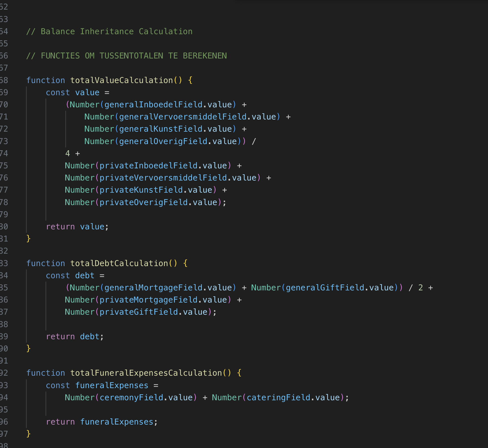
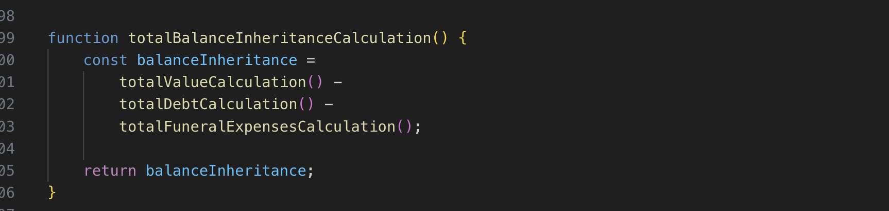

# Browser_Technologies_Mike

# Verslag Gesprekken

<strong>8 februari 2025 - Browser Tech</strong>

### Gesprek: Browser Tech

#### Voortgang

- Inputvelden geanalyseerd en op detailniveau bekeken.
- Onderzoek naar regular expressions (mogelijk via RegExr tool) voor pattern-gebaseerde invoer.
- Breder perspectief bekijken:
  - Anchors naar andere vragen of nieuwe vragen toevoegen indien nodig.
  - Vragen verbergen of invalideren afhankelijk van andere invoer.
  - Inputwaarde doorgeven aan andere vragen indien hetzelfde antwoord vereist is (bijv. "Vul ook in bij vraag 5k").

<strong>5 Mar - Browser Tech</strong>

#### Voortgang

- Dropdown met een overige toggle gemaakt. Uiteindelijk besloten hem beter niet te gebruiken voor snellere UX.

<strong>6 Mar - Browser Tech</strong>

### Gesprek: Browser Tech

#### Voortgang

- radio buttons gestyled met before en focus. Normale appearance uitgezet.
- IBAN Pattern checker toegevoegd voor nederlandse IBAN met 14 karakters.
- Datum maker gemaakt die je max waardes heeft.
- hideable overig gemaakt maar werkt niet zo goed als ik wil dus het veld maar standaard laten staan.
- EIND vd dag: ook nog een foldable vraag gemaakt. Als je op ja klikt komt er nog een extra vraag tevoorschijn

<strong>7 Mar - Browser Tech</strong>

### Gesprek: Browser Tech

#### Voortgang

optioneel toevoegen ipv \* required.
input datalist options interactieve select voor talen bijv. lange lijsten
vormgeving tussendoor om tijd te besparen aan het eind
ol li counter

small> voor kleine extra toevoeging/tekst bij een label.

aan en uit state in radio button vorm > kan een checkbox worden, vraag stellen zodat het een vink wordt als getrouwd is, anders kippen. bijv.

updateBSN()

- var element
- var 2e element - .value attribute runnen als eerst element wordt ingevuld zodat de waarde wordt overgenomen

vragen links uitlijnen en rechts evt vervolgvraag.

min 280 responsive px’s, hoeft niet perfect maar moet wel werken.

<strong>13 Mar - Browser Tech</strong>

### Hiden & togglen van vragen

#### Uitwerking

Ik wilde de toegankelijkheid voor iedereen goed hebben op deze vraag.

De logica werkt als volgt.

Ik laadt alle vragen in.
Op moment dat de javascript werkt/geladen is gaat hij de vragen hiden.
Zodat ze op een later moment als de juiste condities gelden de vragen tevoorschijn komen.

Ik heb de 3 meest voorkomende opties weergegeven. Het is een prototype dus het gaat om het principe van de 'meest gekozen' optie. Ik heb geen data die zegt dat ze dat daadwerkelijk zijn. Maar het is prettig om te hebben bij de grote lijst aan opties van relatie-keuzes. Met optgroup kun je ze dus uniek maken / categoriseren.

<strong>week tot 20 Mar - Browser Tech</strong>

  
  Deze 3 dates hadden een selecter van 3 :has-es en de laaste zou een ::after krijgen om de gebruiker te laten weten dat de 3 inputs user-valid zijn. echter ging ik ze wat stylen om goed op desktop te laten zien en mobiel, maar daarvoor moest ik divs gebruiken. daardoor ging de validatie code stuk.
  
  als oplossing moest ik de selector wat aanpassen en de div styling aanpassen. ik dat als volgt gedaan: 

  
  bovenaan de grid die ik heb gerealiseerd om dit te krijgen:

  

  maar nogsteeds werkte allen mijn enkele validation vinkjes.
  nu de section validator fixen:

  
  na een half uur puzzelen ben ik er met deze selector goed vanaf gekomen.

  
  
  met een nice messsage krijgt de gebruiker nu meer duidelijke validatie en weten ze het goed hebben ingevuld, ik vind dat dit nodig is omdat je handmatig een datum in typt en niet een datum picker gebruikt, dmv de min en max + validatie weetje dat het een valide datum is.

  
  Error messages toegevoegd bij user:invalid. Wel zo prettig dat de gebruiker feedback krijgt als er iets niet goed is. Een gewoon kruis is zo agressief, nu duidelijk in welk format het moet en wat er aangepast moet worden.

### BEREKENING samensetlling erfenis - sectie
 
 
 dit is de genoteerde formule achter het formulier van de overheid om het overzicht te bewaren.

 
 om de code zo overzichtelijk te houden, duidelijke benamingen en comments.

  
  zorgen dat de code worden getoond. standaard op hidden zodat als de JS het niet doet er niets zichtbaar berekend gaat worden. progressive enhancement

  
  hier per sectie de berekening volgens formulie per sectie uitvoeren en opslaan.
  deze worden dan gegbruikt in de formule van de subtotaalberekening

  
  hier wordt een subtotaal berekend door alle sectie waardes te pakken en uit te rekenen
  door return pakken we de numerieke waarden en kunnen we deze gebruiken in de laatste fase 

  
  berekening toaal per persoon en alleen delen door aantal ingevuld in value als hij hoger is dan 1 anders pakken de default value

  
  totaal slotberekening en afronden op 2 decimalen met tofixed2.
  en onderaan de fucntie om de gehele formule uit te voeren telkens als er een aanpassing aan een inputfield.value wordt gedaan.
  
  
  de berekening sectie is nog niet gestyled, wel goed werkend qua technische formule en input waardes

  

 

### Notes jeremy keith gesprek

#### Notes

notes

outline ipv border
outline offset

accent-color

:root{
accent-color for radio checkbox etc

}

least amount of work for most amount of effect

check for type  
value maakt niet
checked value attribute

https://webkit.org/blog/14933/bringing-back-horizontal-rules-in-select-elements/#:~:text=Using%20in%20%3Cselect,authors%20can%20use%20lines%20too.

obtgroup for label

dividing line with HR>

