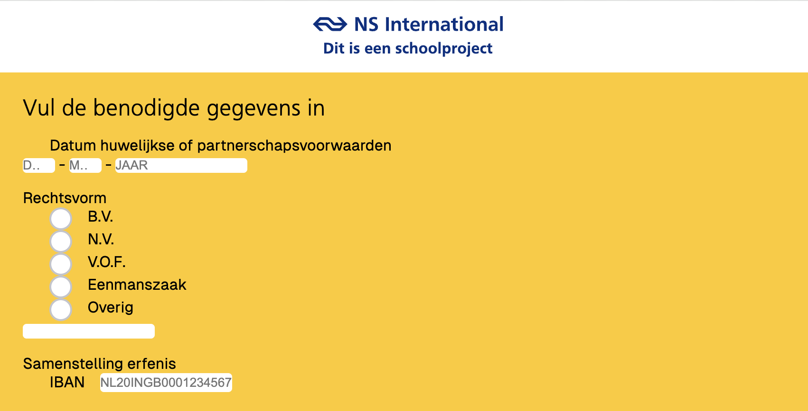

# Browser_Technologies_Mike

# Verslag Gesprekken

<strong>8 februari 2025 - Browser Tech</strong>

### Gesprek: Browser Tech

#### Voortgang

- Inputvelden geanalyseerd en op detailniveau bekeken.
- Onderzoek naar regular expressions (mogelijk via RegExr tool) voor pattern-gebaseerde invoer.
- Breder perspectief bekijken:
  - Anchors naar andere vragen of nieuwe vragen toevoegen indien nodig.
  - Vragen verbergen of invalideren afhankelijk van andere invoer.
  - Inputwaarde doorgeven aan andere vragen indien hetzelfde antwoord vereist is (bijv. "Vul ook in bij vraag 5k").

<strong>5 Mar - Browser Tech</strong>

#### Voortgang

- Dropdown met een overige toggle gemaakt. Uiteindelijk besloten hem beter niet te gebruiken voor snellere UX.

<strong>6 Mar - Browser Tech</strong>

### Gesprek: Browser Tech

#### Voortgang

- radio buttons gestyled met before en focus. Normale appearance uitgezet.
- IBAN Pattern checker toegevoegd voor nederlandse IBAN met 14 karakters.
- Datum maker gemaakt die je max waardes heeft.
- hideable overig gemaakt maar werkt niet zo goed als ik wil dus het veld maar standaard laten staan.
- EIND vd dag: ook nog een foldable vraag gemaakt. Als je op ja klikt komt er nog een extra vraag tevoorschijn

<strong>7 Mar - Browser Tech</strong>

### Gesprek: Browser Tech

#### Voortgang

optioneel toevoegen ipv \* required.
input datalist options interactieve select voor talen bijv. lange lijsten
vormgeving tussendoor om tijd te besparen aan het eind
ol li counter

small> voor kleine extra toevoeging/tekst bij een label.

aan en uit state in radio button vorm > kan een checkbox worden, vraag stellen zodat het een vink wordt als getrouwd is, anders kippen. bijv.

updateBSN()

- var element
- var 2e element - .value attribute runnen als eerst element wordt ingevuld zodat de waarde wordt overgenomen

vragen links uitlijnen en rechts evt vervolgvraag.

min 280 responsive px’s, hoeft niet perfect maar moet wel werken.

